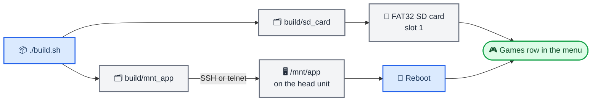
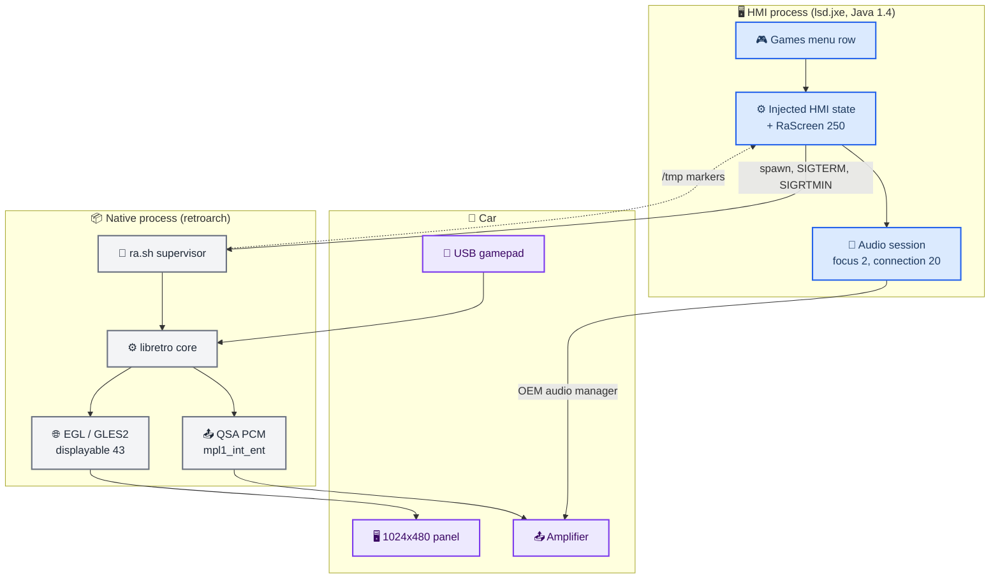

# retroarch-qnx

_Retro game console emulation inside the stock infotainment system of an Audi MHI2Q (MIB2 High) head unit — experimental, one firmware, install over SSH._

---

> ⚠️ **Experimental.** This is a research project for a unit you own. It runs from a shell on the
> head unit: there is no installer, no signed package and no OTA path. Installing means copying
> files over **SSH or telnet** onto a firmware partition you
> temporarily mount writable. If you are not comfortable recovering a head unit that no longer
> boots into the HMI, stop here.

> 🤝 **Help wanted — this project needs contributors.** One person, one car, one firmware is not
> enough to make this good. Bug reports from other units, a Bluetooth pad that finally enumerates,
> a batch of GL calls that stops N64 stuttering, another core, a fixed typo — all of it is welcome.
> See [Help wanted](#-help-wanted). **Pull requests are welcome.**

## 📋 What this is

A port of RetroArch[^1] plus three libretro cores to QNX 6.5 on the Audi MHI2Q head unit
(APQ8064 Krait, Adreno 320, 1024x480), integrated into the car's own HMI rather than bolted on
beside it:

- a **Games** row appears in the main menu; selecting it enters a real HMI state;
- the emulator draws full-screen on its own compositor layer while the stock volume popup still
  renders above it;
- sound goes through the OEM entertainment audio session, so the volume knob, mute and ducking
  behave exactly like radio or media;
- **BACK** / **MENU** return to the car menu and restore whatever was playing before.

Nothing in the firmware is modified on disk — the HMI state machine, display contexts and audio
bundle are patched in memory at runtime and disappear when you delete two paths.

| System | Core | Notes |
| ------ | ---- | ----- |
| **Game Boy Advance** | gpSP | interpreter (dynarec is compiled in, disabled by default) |
| **PlayStation** | PCSX-ReARMed | ARM dynarec + NEON, SPU on its own thread |
| **Nintendo 64** | Mupen64Plus-Next | GLideN64 on GLES2, ARM dynarec, HLE RSP |
| ~~PSP~~ | ~~PPSSPP~~ | ported and measured, **not shipped** — the stock GPU driver is too slow[^2] |

## ⚠️ Status and known issues

Everything up to 2026-08-31 has been exercised on one physical unit. The September 2026 changes
(HMI overlay plane, CarPlay-entry audio fix) are built but **not yet confirmed on hardware** —
see [what is proven vs pending](docs/retroarch-qnx/testing/hardware-validation-matrix.md).

| Issue | Impact | Workaround |
| ----- | ------ | ---------- |
| **CarPlay connected** | Starting *Games* exits back to the car menu almost immediately — CarPlay holds the entertainment audio focus | Disconnect the phone before starting a game |
| **Bluetooth gamepads** | Not supported. Only USB pads work (including Xbox pads through their vendor protocol) | Use a USB pad or a pad with a USB dongle |
| **Performance** | N64 and heavy PS1 titles drop frames; the limit is the head unit's GPU driver, not the emulators[^2] | Prefer 2D/lighter titles; keep the N64 renderer at 640x480 |
| **Save states** | Automatic save-on-pause is disabled until every core passes a manual Save+Load on hardware | Use in-game saves (SRAM is always flushed on exit) |
| **One firmware only** | The HMI hook validates an exact fingerprint of `MHI2Q_US_AUG22_P5087_MU1316` and refuses to install on anything else — safe, but useless on other units | — |

Full list with diagnosis notes: [known issues](docs/retroarch-qnx/testing/known-issues.md).

## 🤝 Help wanted

**Pull requests are welcome — for anything, at any size.** There is a lot of surface here and one
maintainer with one head unit, so almost every area below is blocked on "nobody has tried it yet"
rather than on a hard problem. Nothing needs permission: open a PR, or open an issue with a log.

### Where help matters most

| Area | What is needed | Difficulty |
| ---- | -------------- | ---------- |
| **Other head units** | Run it, report what happens. Different firmware means a different state-table fingerprint; the injector refuses safely, and the numbers in `ra_hook.log` are exactly what is needed to support your unit ([games-menu-injection](docs/retroarch-qnx/hmi/games-menu-injection.md)) | 🟢 easy, just needs a car |
| **CarPlay coexistence** | The audio session loses the entertainment focus to CarPlay and the game exits. Reproduce with `ra_audio.log`, or fix the acquisition order ([audio-session](docs/retroarch-qnx/hmi/audio-session.md)) | 🟡 medium |
| **Bluetooth gamepads** | Give the session's io-hid a second transport and drive pairing from `btstack` instead of the phone UI ([input-hid-xusb](docs/retroarch-qnx/native/input-hid-xusb.md)) | 🟡 medium |
| **More cores** | Adding a system is a core build, an info file and one `ruleN_*` block — no scanner changes. SNES, Mega Drive, NES, PC Engine are all plausible on this CPU ([cores-overview](docs/retroarch-qnx/cores/cores-overview.md), [content-discovery](docs/retroarch-qnx/native/content-discovery.md)) | 🟢 easy |
| **Controller and rumble profiles** | Pure data: a verified `autoconfig/qnx/*.cfg` or a `rumble/qnx/<vid>_<pid>_<report>.cfg` for a pad you own. No rebuild of the frontend required | 🟢 easy |
| **GL call reduction** | The GPU driver burns ~16 ms per frame validating commands. Batching compatible draws and caching redundant uniform/state calls is measured to cut 40-70 % of that ([gles2-benchmark](docs/retroarch-qnx/perf/gles2-benchmark.md), [adreno-driver-hotpath](docs/retroarch-qnx/re/adreno-driver-hotpath.md)) | 🔴 deep |
| **Freedreno on hardware** | A Mesa A3xx backend over the stock GSL transport already clears the QEMU gates; gates 1-7 on a physical unit are the blocker ([freedreno-qnx](docs/retroarch-qnx/research/freedreno-qnx.md)) | 🔴 deep |
| **PPSSPP** | The port exists and is measured; it comes back the moment the GL path is fast enough ([ppsspp-status](docs/retroarch-qnx/cores/ppsspp-status.md)) | 🔴 deep |
| **Save states** | One manual Save + Load per core on hardware is all that stands between the current state and re-enabling automatic save-on-pause ([signals-and-lock](docs/retroarch-qnx/hmi/signals-and-lock.md)) | 🟢 easy, needs a car |
| **Frame pacing** | Decide vsync versus blocking audio with a real measurement of the panel's refresh rate ([frame-and-audio-pacing](docs/retroarch-qnx/perf/frame-and-audio-pacing.md)) | 🟡 medium |
| **Documentation** | Typos, unclear steps, a diagram that would explain something better than the paragraph next to it | 🟢 easy |

### How to contribute

- **Bug report** — attach `ra_hook.log`, `ra_audio.log`, `/tmp/ra_display.log` and the newest
  `retroarch__*.log` from `/fs/sda0/retroarch/logs/`. Those four files answer most questions.
- **Code** — `./build.sh` must pass; keep the QNX-specific reasoning in a comment where a future
  reader will trip over it, and update the matching note in `docs/retroarch-qnx/`.
- **Claims** — if something was verified on hardware, say so; if it was reasoned but untested, say
  that too. Every note carries a `status` field for exactly this reason.
- **No secrets** — no passwords, VINs, or device logs containing personal data in commits.

## 🔧 Requirements

**On your laptop (macOS or Linux):**

| Need | Why |
| ---- | --- |
| Docker | the cross-toolchain image `qnx65-armv7-toolchain` (GCC 8.5.0 + binutils 2.38 `as`), built from [luka-dev/qnx65-armv7-toolchain](https://github.com/luka-dev/qnx65-armv7-toolchain) — clone it next to this repo |
| JDK 8 + MU1316 class/JCL jars | compiling the HMI hook against the device class library (`../jxe2jar`) |
| `sshpass` | optional, only for the helper scripts that drive the unit |

**On the head unit:**

| Need | Detail |
| ---- | ------ |
| Hardware | MHI2Q / MU1316 (APQ8064, Adreno 320, 1024x480), US navigation variant |
| Firmware | `MHI2Q_US_AUG22_P5087_MU1316` |
| Shell access | root over **SSH or telnet** (`telnetd` is enabled in `/etc/inetd.conf`) — whichever you have, as long as you can write to `/mnt/app` |
| Network | reachable over its Ethernet/OBD link. **The address is yours to find** — it depends on the unit and how it is wired. Docs and scripts read it from `$HU_HOST` (`root@<ip>`) |
| Media | FAT32 SD card in slot 1 (tested: 32 GB) |

> 📌 **Note:** getting root shell access to a MIB2 unit is outside the scope of this repository.
> It assumes you already have it.

## 🚀 Install

```bash
git clone https://github.com/luka-dev/audi-mib2q-retroarch.git retroarch-qnx
cd retroarch-qnx
./build.sh
```

`build.sh` compiles the HMI jar, the frontend and the three cores inside Docker, then stages two
directly deployable trees:



1. **SD card** — copy the contents of `build/sd_card/` to a FAT32 card. Games go in
   `retroarch/ps1` (`.cue`/`.chd`/`.pbp`), `retroarch/gba` (`.gba`) and `retroarch/n64`
   (`.z64`/`.n64`/`.v64`), each scanned recursively; the PS1 BIOS goes in `retroarch/system/`.
   Playlists build themselves on launch — no scan step
   ([install guide, step 1](docs/retroarch-qnx/deploy/install-procedure.md)).
2. **App image** — over SSH: `mount -uw /mnt/app`, copy the contents of `build/mnt_app/` into
   `/mnt/app/`, `chmod 755` the binary and `ra.sh`, `sync`, `mount -ur /mnt/app`.
3. **Reboot** the unit (the HMI loads jars at boot), then open **Games**.

The step-by-step version with the exact commands, expected log lines and verification is the
[install guide](docs/retroarch-qnx/deploy/install-procedure.md). It is the document to follow —
the three lines above are only the shape of it.

Two optional helpers: `./run-macos.sh` builds the same UI as a native macOS app at 1024x480 for
menu work without the car, and `./fetch-thumbnails.sh <games dir>` downloads box art into the SD
tree.

## ⚙️ How it works

The HMI is a Java state machine running inside the OEM `lsd.jxe` process. On the first *Games*
press, the hook appends one state and two transitions to that machine at runtime — fail-closed
against a fingerprint of the stock tables — and the new state's screen launches the native
emulator. From then on the two halves talk only through POSIX signals and marker files in `/tmp`;
there is no socket and no IPC protocol.



The long version, with the display-context and audio sequences:
[architecture](docs/retroarch-qnx/architecture.md).

## 📚 Documentation

Documentation lives in an Obsidian vault at **`docs/retroarch-qnx/`** — open the folder as a vault,
or just read the Markdown. Start at [`INDEX.md`](docs/retroarch-qnx/INDEX.md); every note records
how its facts were verified (device log, firmware disassembly, or source).

| I want to… | Read |
| ---------- | ---- |
| install or update the unit | [install-procedure](docs/retroarch-qnx/deploy/install-procedure.md) |
| know what breaks and why | [known-issues](docs/retroarch-qnx/testing/known-issues.md), [hardware-validation-matrix](docs/retroarch-qnx/testing/hardware-validation-matrix.md) |
| build, or fix a toolchain trap | [build-pipeline](docs/retroarch-qnx/build/build-pipeline.md), [toolchain](docs/retroarch-qnx/build/toolchain.md) |
| change the HMI hook | [games-menu-injection](docs/retroarch-qnx/hmi/games-menu-injection.md), [session-lifecycle](docs/retroarch-qnx/hmi/session-lifecycle.md), [audio-session](docs/retroarch-qnx/hmi/audio-session.md) |
| touch video, audio or input code | [video-context](docs/retroarch-qnx/native/video-context.md), [audio-qsa](docs/retroarch-qnx/native/audio-qsa.md), [input-hid-xusb](docs/retroarch-qnx/native/input-hid-xusb.md) |
| add or tune a core | [cores-overview](docs/retroarch-qnx/cores/cores-overview.md), [jit-icache-qnx](docs/retroarch-qnx/cores/jit-icache-qnx.md) |
| profile or debug a crash | [profiler](docs/retroarch-qnx/perf/profiler.md), [qnx-sync-cost](docs/retroarch-qnx/cores/qnx-sync-cost.md) |
| understand the GPU ceiling | [adreno-driver-hotpath](docs/retroarch-qnx/re/adreno-driver-hotpath.md), [freedreno-qnx](docs/retroarch-qnx/research/freedreno-qnx.md) |

Superseded long-form write-ups are kept unchanged in `docs/legacy/` for history.

## 🔍 Troubleshooting

| Symptom | Cause / fix |
| ------- | ----------- |
| No **Games** row | jar not in `/mnt/app/eso/hmi/lsd/jars/`, or the unit was not rebooted |
| *Games* does nothing; `ra_hook.log` says `runtime SMM install FAILED` | firmware is not MU1316 — the state-table fingerprint did not match and nothing was changed |
| Exits to the car menu after a few seconds | usually CarPlay (see [known issues](docs/retroarch-qnx/testing/known-issues.md)); otherwise read `ra_audio.log` |
| `refusing relaunch: prior native process missed exit timeout` | a previous RetroArch is still alive — `slay -f -Q retroarch`, then retry |
| Black screen, `/tmp/ra_display.log` ends at `FAIL egl_init_context` | started outside `ra.sh`, so `GRAPHICS_ROOT` was unset |
| Pad not detected | check the newest `logs/retroarch__*.log` for HID topology; `hidview` on the unit shows what the pad reports |
| Unit stops answering ssh after a video experiment | you asked for 4 Screen buffers; only 2 or 3 are supported |
| `tar` / `date` "not found" over ssh | the login PATH lacks `/armle/usr/bin` — `export PATH=/armle/usr/bin:/armle/bin:$PATH` first |

Logs: `/fs/sda0/retroarch/logs/` (`ra_run.log`, `ra_hook.log`, `ra_audio.log`,
`retroarch__*.log`) and `/tmp/ra_display.log`.

## 🚫 Limitations and non-goals

- **Not a general QNX port of RetroArch.** The BlackBerry 10 code paths were replaced, not
  maintained; there is no `./configure`, and nothing here is upstreamable as-is.
- **One unit, one firmware.** Other MIB2 variants — including the G24 cluster, where display
  context 90 collides with a stock context — are out of scope.
- **No PSP.** The stock Adreno GLES2 driver spends roughly 16 ms per PSP frame validating
  commands on the CPU[^2]. A Mesa/Freedreno backend exists under `tools/qnx-freedreno`, but it is
  QEMU-validated research, not a shipping driver.
- **No online features.** No updaters, netplay, achievements or thumbnail downloads on the unit;
  everything comes from the SD card.
- **No install tooling.** Deployment is manual file copying by design — a flasher would imply a
  safety story this project does not have.

## 🗂️ Repository layout

```text
src/            RetroArch (vendored; QNX frontend, display, QSA audio, HID/XUSB input, lifecycle)
cores-src/      gpsp, pcsx_rearmed, mupen64plus_next (shipped); ppsspp (ported, not shipped)
java_patch/     HMI hook sources (Java 1.4)      lsd_patch/  jar build script + ra_mhi2q.jar
pkg/            factory config, ra.sh, assets, controller/rumble profiles, databases, cheats
build/          deployable trees (mnt_app, sd_card) and research artefacts
tools/          qnx-qemu, qnx-tests, qnx-bench, qnx-profiler, qnx-freedreno, qnx-gsl-port
docs/           retroarch-qnx/ (Obsidian vault), legacy/     output/r2/  RE disassembly evidence
```

Upstream commits of every vendored tree: [`VENDORED_SOURCES.md`](VENDORED_SOURCES.md).

## 🔗 License

RetroArch and the cores are GPL-3.0 (`src/COPYING`, and each tree under `cores-src/`); the QNX
changes in those trees are contributed under the same licenses. The HMI hook in `java_patch/` and
the scripts in this repository are provided as-is for use with a unit you own. Assets under `pkg/`
carry their own `COPYING` / `SOURCE.txt` — Ozone and Audi UI assets, libretro databases
(CC BY-SA 4.0), controller profiles.

Audi, MMI and MIB are trademarks of their respective owners. This project is not affiliated with,
endorsed by, or supported by them.

---

[^1]: libretro. "RetroArch." _GitHub_. https://github.com/libretro/RetroArch

[^2]: Measured on the unit with the project's own GLES2 benchmark: a PSP-shaped command stream costs 22.99 ms per frame, of which 15.7 ms is driver-side validation and command generation. See [`gles2-benchmark`](docs/retroarch-qnx/perf/gles2-benchmark.md) and [`adreno-driver-hotpath`](docs/retroarch-qnx/re/adreno-driver-hotpath.md).
