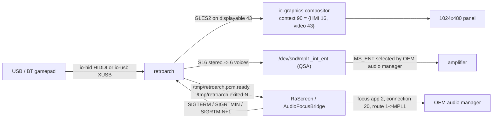

# Architecture - what runs where

RetroArch (griffin unity build) + three libretro cores, ported to the Audi MHI2Q head unit
(firmware `MHI2Q_US_AUG22_P5087_MU1316`, QNX Neutrino 6.5.0, APQ8064 Krait 4x1512 MHz, Adreno 320,
1024x480 panel). Start at [[INDEX]].

## The two halves

| Half | Where it lives | Language | Output | Notes |
|---|---|---|---|---|
| **HMI hook** | `java_patch/java_src/` -> `lsd_patch/ra_mhi2q.jar` -> `/mnt/app/eso/hmi/lsd/jars/` | Java 1.4 / J9 | a *Games* row in the main wizard, a SystemSMM state, an OEM audio session | [[games-menu-injection]] [[session-lifecycle]] [[audio-session]] |
| **Native** | `src/` -> `/mnt/app/root/retroarch/retroarch` + `cores/*.so` | C (GCC 8.5, armle-v7) | the emulator: EGL/GLES2 on displayable 43, QSA PCM, HID/XUSB pads | [[video-context]] [[audio-qsa]] [[input-hid-xusb]] [[signals-and-lock]] |

The HMI decides; the emulator obeys. There is **no socket, no localhost protocol, no DSI client in
native code**. The only channels between the halves are:

- **POSIX signals** Java -> native (`kill` on the PID read from `/tmp/retroarch.lock`);
- **marker files in `/tmp`** native -> Java (`retroarch.pcm.ready`, `retroarch.exited.<gen>`);
- one **desired-state file** Java -> native (`retroarch.audio.desired`).

## Why the stock "QNX" port was not usable

Upstream RetroArch's QNX support is the BlackBerry 10 port: BPS (`bps/navigator`), OpenAL, Screen
owned by the app. MHI2Q has none of that - Kanzi owns Screen, audio is io-audio/QSA behind an OEM
audio manager, and pads arrive via io-hid / io-usb. Every QNX driver in `src/` was rewritten:

| Layer | BB10 port | This port |
|---|---|---|
| window/context | bps navigator -> EGL | `libdisplayinit.so` -> Screen window on displayable 43 -> EGL ([[video-context]]) |
| platform/lifecycle | bps events | `sigwaitinfo()` thread + lock file ([[signals-and-lock]]) |
| input | bps touch/keys | io-hid HIDDI + io-usb XUSB/GIP ([[input-hid-xusb]]) |
| audio | OpenAL | QSA PCM on `mpl1_int_ent`; focus/route from Java ([[audio-qsa]] [[audio-session]]) |

## Process topology

```text
lsd.jxe  (OEM HMI JVM, alive from boot)
  +- MainWizard "Games" row      (AbstractPlaceholderMenuController$1 shadow -> HookManager)
  +- SystemSMM state 631 / screen 250 = RaScreen   (appended at runtime, fail-closed)
  +- AudioFocusBridge worker  "retroarch-audio-focus"
  +- MediaSessionBridge        (IMediaTerminalExtension on the stock Media terminal 0)
  +- exit / release watchers   (poll /tmp markers)
        |
        |  Runtime.exec("/bin/sh -c ... /mnt/app/root/retroarch/ra.sh ...")
        v
/bin/sh  ra.sh   (stays as supervisor: owns io-hid, waits for the child, clears markers)
  +- /armle/sbin/io-hid -d usb upath=/dev/io-usb/io-usb     (one instance per session)
  +- /mnt/app/root/retroarch/retroarch --config /fs/sda0/retroarch/config/retroarch.cfg
        +- writes its own PID to /tmp/retroarch.lock
        +- dlopen cores/*.so
        +- dmdt dc 90 16 43 ; dmdt sc 0 90            (display context, see display-context-90)
```

## Steady-state data flow



## Threads that matter

- **native**: main/runloop (reconciles lifecycle atomics once per frame in `check_window`), one
  `sigwaitinfo()` lifecycle thread, QSA worker thread, HID poll thread(s), core threads
  (PCSX SPU thread, GLideN64 threaded GL).
- **Java**: HMI event thread (menu hooks, `fireSMEvent`), `retroarch-audio-focus` worker,
  `retroarch-exit-watcher`, `retroarch-audio-release-watcher`, `retroarch-prior-exit-waiter`,
  `retroarch-shell-reaper`.

## Build & deploy quickref

```sh
./build.sh                # jar + frontend + 3 cores -> build/mnt_app, build/sd_card
./build.sh clean
./lsd_patch/build.sh      # jar only
./run-macos.sh            # host UI smoke (Ozone at 1024x480, native arm64 cores)
```

Details: [[build-pipeline]], [[toolchain]], [[java-jar-build]], [[install-procedure]].

## Status at a glance

See [[hardware-validation-matrix]] for what is proven on the unit and what is only built.
