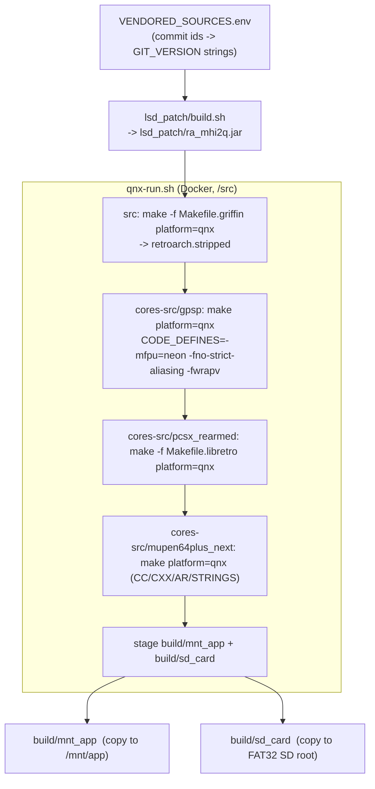

# build.sh - stages and outputs

`./build.sh` is the only production entry point. It runs on the host, shells into the toolchain
container once, and leaves two deployable trees. `./build.sh clean` removes products but preserves
SD games/BIOS.

## Stage details

1. **Manifest** - `VENDORED_SOURCES.env` must define `RETROARCH_SOURCE_COMMIT`,
   `GPSP_SOURCE_COMMIT`, `PCSX_REARMED_SOURCE_COMMIT`, `MUPEN64PLUS_NEXT_SOURCE_COMMIT`. The first
   7 chars become each binary's `GIT_VERSION`. See [[vendored-sources]].
2. **Jar** - `lsd_patch/build.sh` ([[java-jar-build]]). Runs on the host JDK 8, not in Docker.
3. **Frontend** - griffin unity build; output filtered to `Error|error:|undefined reference`; the
   link is verified by the existence of `retroarch`. Stripped copy is what ships.
4. **Cores** - each core is `make clean` + `make -j4` from scratch, then stripped:
   - gpSP: compiled with `HAVE_DYNAREC := 1` + `MMAP_JIT_CACHE = 1` (Makefile qnx block) but the
     factory core option is `gpsp_drc = "disabled"` -> interpreter at runtime ([[cores-overview]]).
   - PCSX-ReARMed: ARM dynarec + NEON.
   - Mupen64Plus-Next: GLideN64 GLES2 + ARM dynarec; needs `STRINGS=` for its makefile.
5. **Staging** - see [[filesystem-layout]] for the exact trees. Required inputs are asserted first:
   `pkg/runtime-libs/{libstdc++.so.6,libhiddi.so.1}`, `pkg/info/*.info`, `pkg/database/rdb`,
   `pkg/cheats`, `pkg/rumble/qnx`, `pkg/assets/ozone/regular.ttf`,
   `pkg/assets/xmb/monochrome/png/default.png`.
6. **SD content preservation** - `build/sd_card/retroarch/{ps1,gba,n64,roms,system,autoconfig}` are
   moved to `build/.sd-content-preserve/` before `rm -rf build/sd_card`, then moved back. An
   interrupted build is recovered on the next run (refuses if both live and preserved copies exist).
   `system/PPSSPP` is deleted after restore (PPSSPP is not shipped).
7. **Cleanup** - all compiler intermediates and un-staged binaries are removed; the staged trees are
   the canonical artefacts and are committed to git.

## What the summary prints

Sizes of frontend/cores/trees, asset/profile/info/rdb/cht counts, content counts, and the ELF
header (`Machine: ARM`, `Flags: Version5 EABI`). Current numbers: frontend 2 330 824 B, gpSP 671 856 B,
PCSX 1 421 452 B, Mupen 3 227 888 B, jar 54 063 B.

## Not part of build.sh

- `run-macos.sh` - host UI smoke build under `out/macos-test/` ([[architecture]]).
- `tools/qnx-tests/*.sh`, `tools/qnx-qemu/*.sh` - QEMU test suites ([[qemu-harness]]).
- `tools/qnx-bench/build-gles2.sh`, `tools/qnx-freedreno/*.sh`, `tools/qnx-gsl-port/build-probe.sh`
  - research tools ([[gles2-benchmark]], [[freedreno-qnx]], [[gsl-port-boundary]]).
