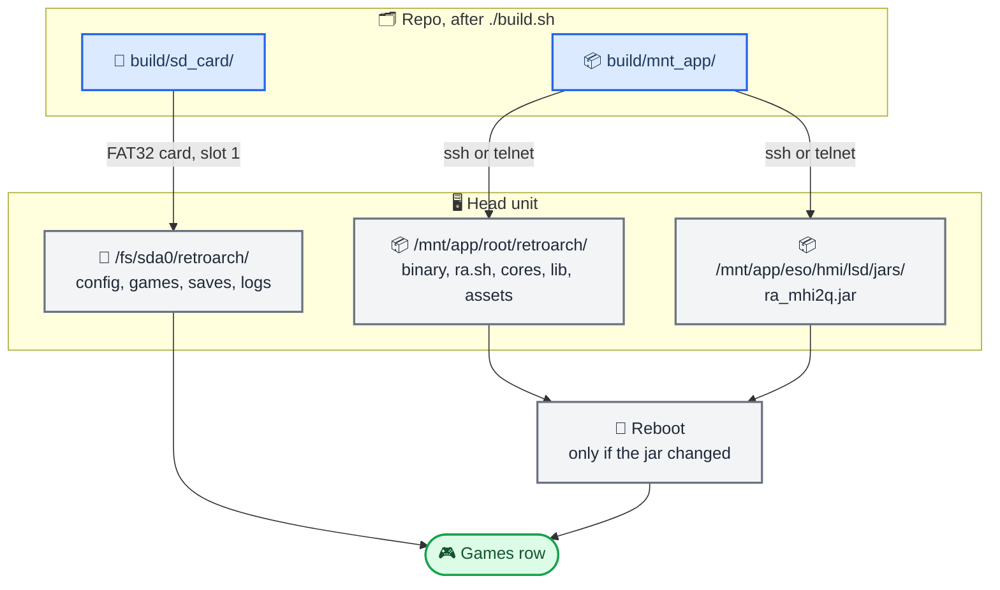

# Install guide

_Two new paths on the app image plus an SD card, copied by hand from a root shell — about 20 minutes the first time, 3 for an update._

---

> ⚠️ **Experimental, manual, unsigned.** There is no installer, no update package and no OTA path.
> You copy files onto the firmware partition yourself. Know how you would recover the unit before
> you start.

> 📌 **This install replaces no stock file.** It adds `/mnt/app/root/retroarch/` and one jar, and
> nothing else on the unit is overwritten — no patched firmware binaries, no edited OEM configs.
> Removing those two paths returns the unit to stock.

## 📋 Before you start

- [ ] **Root shell over SSH or telnet.** Those are the two ways in — `telnetd` is enabled in
      `/etc/inetd.conf`. This guide uses SSH; over telnet the file copies become `cat > file`
      paste-ins or a shared SD card. Getting that access is out of scope here.
- [ ] **The unit's address.** It depends on your unit and how it is wired, so there is no default
      to quote. The snippets below and `tools/qnx-bench/run-session.sh` both read it from
      `HU_HOST` (`root@<ip>`); the example address is a documentation one, replace it. Over SSH
      the host key is legacy RSA, so a modern client needs
      `-oHostKeyAlgorithms=+ssh-rsa -oPubkeyAcceptedAlgorithms=+ssh-rsa`; the repo's parent
      directory has `audi_ssh.sh` (`shell` / `exec` / `put` / `get`) which wraps that.
- [ ] **The right firmware.** `MHI2Q_US_AUG22_P5087_MU1316`. On anything else the HMI hook fails
      closed and *Games* does nothing ([[known-issues]]).
- [ ] **A built tree.** `./build.sh` has produced `build/mnt_app/` and `build/sd_card/`
      ([[build-pipeline]]).
- [ ] **Ignition on**, HMI booted, no game running (`slay -f -Q retroarch` if unsure).
- [ ] **Games and BIOS** already in `build/sd_card/retroarch/` — they survive rebuilds.
      `./fetch-thumbnails.sh <games dir>` fetches box art into the same tree.



## 🔗 The artifact map

`build.sh` already lays both trees out exactly as they must appear on the unit, and sets the modes
(`755` for the binary and `ra.sh`, `644` for everything else). Copying the tree preserves that; the
table is here so a hand-placed file lands correctly too.

| What | Source in the repo | On-unit path | Mode |
| ---- | ------------------ | ------------ | ---- |
| Frontend binary | `src/retroarch.stripped` (staged) | `/mnt/app/root/retroarch/retroarch` | 755 |
| Launcher | `pkg/ra.sh` | `/mnt/app/root/retroarch/ra.sh` | 755 |
| Factory config, core options, scan rules | `pkg/{retroarch.cfg,retroarch-core-options.cfg,content-rules.cfg}` | `/mnt/app/root/retroarch/` | 644 |
| Cores | built from `cores-src/` | `/mnt/app/root/retroarch/cores/*.so` | 644 |
| Runtime libraries | `pkg/runtime-libs/{libstdc++.so.6,libhiddi.so.1}` | `/mnt/app/root/retroarch/lib/` | 644 |
| UI assets | `pkg/assets/{ozone,audi,pkg,xmb}` | `/mnt/app/root/retroarch/assets/` | 644 |
| Controller profiles | `pkg/autoconfig/qnx/*.cfg` | `/mnt/app/root/retroarch/autoconfig/qnx/` | 644 |
| Rumble profiles | `pkg/rumble/qnx/*.cfg` | `/mnt/app/root/retroarch/rumble/qnx/` | 644 |
| Core info seed | `pkg/info/*.info` | `/mnt/app/root/retroarch/info/` | 644 |
| **HMI hook** | `lsd_patch/ra_mhi2q.jar` | `/mnt/app/eso/hmi/lsd/jars/ra_mhi2q.jar` | 644 |
| User layer | `build/sd_card/retroarch/` | `/fs/sda0/retroarch/` | on the card |

Full reasoning for the split: [[filesystem-layout]].

## 💾 Step 1 — SD card

1. Format a card as **FAT32** (32 GB tested).
2. Copy the **contents** of `build/sd_card/` to the card root, so the card has `retroarch/` at top
   level with `config/`, `ps1/`, `gba/`, `n64/`, `system/`, `database/`, `cheats/`, …
3. Eject cleanly and insert it into **slot 1** — it mounts as `/fs/sda0`.

A blank card also works: `ra.sh` seeds config, core info and controller profiles on first launch.
Only databases, cheats and box art come exclusively from the image.

## 📦 Step 2 — App image

Everything you type on the unit runs in **ksh** (`/bin/sh` is a symlink to `/bin/ksh`), and the ssh
login PATH lacks `/armle/usr/bin`, where `tar`, `scp`, `cksum`, `date`, `tail` and `wc` live — so
every remote command below prepends it.

```bash
export HU_HOST=root@192.0.2.10          # your unit's address, once per shell
SSH="ssh -oHostKeyAlgorithms=+ssh-rsa -oPubkeyAcceptedAlgorithms=+ssh-rsa $HU_HOST export PATH=/armle/usr/bin:/armle/bin:\$PATH;"

# 1. make the app image writable and create the two target directories
$SSH 'mount -uw /mnt/app && mkdir -p /mnt/app/root/retroarch /mnt/app/eso/hmi/lsd/jars'

# 2. push the tree; tar preserves paths and modes in one command
tar -C build/mnt_app -cf - . | $SSH 'tar -C /mnt/app -xf -'

# 3. flush and go back to read-only
$SSH 'chmod 755 /mnt/app/root/retroarch/retroarch /mnt/app/root/retroarch/ra.sh; sync; mount -ur /mnt/app'
```

Make sure no game is running while you copy (`slay -f -Q retroarch`): the frontend binary, the
cores and `ra.sh` are open during a session.

### Verify what landed

```bash
$SSH 'ls -l /mnt/app/root/retroarch/retroarch /mnt/app/eso/hmi/lsd/jars/ra_mhi2q.jar'   # sizes match build/mnt_app
$SSH 'ls /mnt/app/root/retroarch/cores/'                                                 # three .so files
$SSH 'grep RA_LOCK_PATH /mnt/app/root/retroarch/ra.sh'                                   # /tmp/retroarch.lock
$SSH 'cksum /mnt/app/root/retroarch/retroarch'                                           # optional, compare with the host
```

## 🔄 Step 3 — Reboot

Required **only when `ra_mhi2q.jar` changed** — the HMI loads jars at boot, and the runtime
injection happens on the first *Games* press after that. A native-only update (binary, cores,
`ra.sh`, config) takes effect at the next launch with no reboot.

> ⚠️ **Never reboot the unit unasked.** Whoever owns the car is usually sitting in it. Copy the
> files, say what is staged and that a restart is needed, then stop and let them do it.

## 🎮 Step 4 — First launch

1. Main menu → a new **Games** row. Select it.
2. Within a few seconds the RetroArch menu appears full-screen with sound. Turn the volume knob:
   the stock popup still draws on top.
3. Plug in a **USB** pad (Bluetooth pads are not supported, [[known-issues]]), pick a game from a
   playlist, play.
4. **BACK** or **MENU** returns to the car menu and restores the previous audio source.

A healthy first entry writes these lines, in this order:

```text
[SMM] runtime SMM install PASS: state=631 enterTrans=890 exitTrans=891 screen=250   (ra_hook.log)
RA state connected: acquiring OEM audio, saved context 25, native route=90{16,43}, clear=transparent
OEM route ready: launched native RetroArch
=== EGL context up: 1024x480 displayable=43 -- SUCCESS ===                          (ra_display.log)
routed display 0 -> context 90 {16,43}
ACTIVE focus=2 connection=20 route=1->1 PCM=ready                                   (ra_audio.log)
```

Read them over ssh:

```bash
$SSH 'cat /fs/sda0/retroarch/logs/ra_hook.log'    # HMI side: injection + lifecycle
$SSH 'cat /fs/sda0/retroarch/logs/ra_audio.log'   # OEM audio session
$SSH 'cat /tmp/ra_display.log'                    # EGL / display routing
$SSH 'ls /fs/sda0/retroarch/logs/'                # retroarch__<timestamp>.log = frontend
```

| Symptom | Where to look |
| ------- | ------------- |
| No *Games* row | jar not in `/mnt/app/eso/hmi/lsd/jars/`, or not rebooted |
| *Games* does nothing | `ra_hook.log`: `runtime SMM install FAILED` = wrong firmware fingerprint |
| Back to the menu after a few seconds | CarPlay connected is the common cause ([[known-issues]]); otherwise the last lines of `ra_audio.log` |
| `refusing relaunch: prior native process missed exit timeout` | `slay -f -Q retroarch`, then retry |
| Black screen, `ra_display.log` ends at `FAIL egl_init_context` | started outside `ra.sh`, so `GRAPHICS_ROOT` was unset |
| No pad | HID topology lines in the newest `retroarch__*.log`; `hidview` shows what the pad reports |

## 🌐 SSH transport traps

The unit is a bare QNX environment. Four things bite a naive copy:

| Trap | Fix |
| ---- | --- |
| The login PATH omits `/armle/usr/bin`, so `tar`, `scp`, `cksum` and `date` look missing | Prepend it in every remote command, as above. If your unit genuinely lacks them, fall back to `ssh host 'cat > /path'` per file |
| `/mnt/app` is mounted read-only | `mount -uw /mnt/app` before copying, `mount -ur` after; the remount survives a reboot, so put it back |
| `/tmp` is `/dev/shmem` and cannot hold directories | Every marker file lives flat in `/tmp` — `RA_LOCK_PATH` must stay `/tmp/retroarch.lock` with no subfolder, and it must match the constant in the jar ([[session-lifecycle]]) |
| `ssh` inside a `while read` loop eats the loop's stdin | Use `ssh -n` (or `< /dev/null`) in loops |

The login banner prints on stdout even for `ssh host cmd`, so when reading a binary back, print a
marker first (`echo __BEGIN__; cat file`) and strip everything up to it.

## ⚙️ Updating and removing

**SD only** (games, config, profiles): swap or re-copy the card; it takes effect at the next
launch. Config, saves and playlists already on a card are never overwritten by an app update —
only the versioned migrations in `ra.sh` touch config ([[configuration]]).

**Native only:** Step 2 without the jar, no reboot.

**Jar:** Step 2 plus a reboot.

**Remove:**

```bash
$SSH 'mount -uw /mnt/app; rm -rf /mnt/app/root/retroarch /mnt/app/eso/hmi/lsd/jars/ra_mhi2q.jar; sync; mount -ur /mnt/app'
```

then reboot. Nothing else needs restoring: the state-machine tables, display contexts and audio
bundle are only patched in memory while the HMI runs, so they come back stock on their own. The SD
card can stay in — without the jar nothing reads it.

## 🔍 Collecting diagnostics

For a bug report: `ra_run.log`, `ra_hook.log`, `ra_audio.log`, the newest `retroarch__*.log` (all
in `/fs/sda0/retroarch/logs/`), `/tmp/ra_display.log`, `/tmp/qsa_perf.log`, and for a crash the
newest `/mnt/ota/system/core/*.core.gz` ([[profiler]]). `tools/qnx-bench/run-session.sh` automates
a timed launch plus log harvest ([[gles2-benchmark]]).
