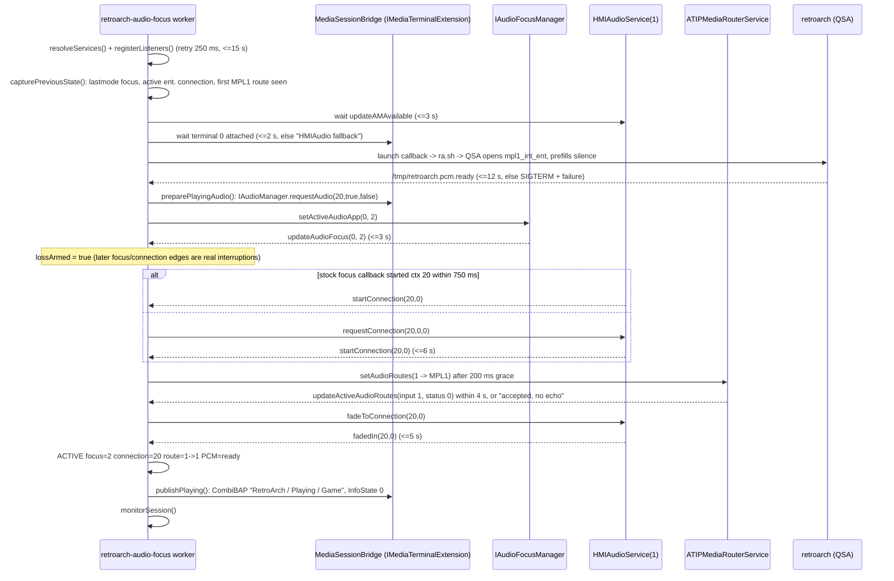

# Audio session - OEM focus, connection 20, route, fade

Two separate problems: getting PCM out (native QSA, [[audio-qsa]]) and getting the head unit to
*play* it - focus, entertainment connection, router, fade. The second half lives in Java and uses
exactly the three public services the stock Media app uses. Verified on HU up to and including
the `ACTIVE` state and clean release (Aug 2026); the `MediaSessionBridge` addition (Sep 2026) is
built and unit-checked but **not yet confirmed on the unit**.

## Vocabulary

| Term | Value | Owner |
|---|---|---|
| front terminal | 0 | - |
| focus app **2** = Media | `IAudioFocusManager.setActiveAudioApp(0, 2)` | stock focus manager |
| connection **20** = `CL_ENT_AMP_MEDIA_MFP` | `HMIAudioService(CLIENT_MEDIA=1).requestConnection(20,0,0)` | stock HMIAudio arbiter (owns the DSI/RPC client) |
| connection **9** | entertainment suppression / `NO_PLAYABLE_FILES` context Media falls back to | stock Media app |
| route **1 -> MPL1** | `ATIPMediaRouterService.setAudioRoutes({input 1 (ENT_INTMEDIA), output 1 (MPL1)})` | stock ATIP router owner |
| `MS_ENT` | the hardware entertainment source selector (one `mplN` -> amp) | the OEM audio manager - **never written by us** (gpSP did; it fought the HMI and collided with CarPlay on `mpl5`) |
| focus 48 | CarPlay | - |

Deliberately **not** used: raw `DSIMediaRouter` client, SDIS `setAudioContext`, `framework.json`
edits, a native DSI client - each would create a second state machine beside the OEM owner. The jar
build fails if such calls appear ([[java-jar-build]]).

## Acquisition sequence (`runSession`)



Why native launches **before** the connection: on MU1316 a STARTED entertainment connection with
no PCM producer is paused again within tens of ms, which bounced RaScreen straight back to the
MainWizard. QSA prefill is inaudible until the fade, so the order is safe.

Why `MediaSessionBridge`: when entering from CarPlay (focus 48) the stock Media focus callback
raced our direct connection-20 request and restored its own `NO_PLAYABLE_FILES` context 9,
stopping 20. Registering an `IMediaTerminalExtension` (service property terminal 0) hands us the live
`IMediaTerminal`; `getAudioManager().requestAudio(20, true, false)` makes 20 Media's *own* active
context, so its focus callback starts 20 instead of 9. The extension contributes no content provider.

## Failure before `ACTIVE`

- services / audio manager / launch / PCM-ready failures -> `abortBeforeNative` or SIGTERM +
  `notifyFailure` -> `RetroArchHook.requestRaExit()` (back to MainWizard; nothing silent ships);
- focus/STARTED/route/fade timeouts after native started -> `waitMutedForRecovery`: SIGRTMIN to
  native (pause + QSA stop), RA screen stays, `monitorSession` waits for the OEM to give focus back.

## Interruptions while ACTIVE (`monitorSession`)

Triggers (`signalFocusLost`): focus app != 2, `pauseConnection/stopConnection/errorConnection(20)`,
`updateAMAvailable(false)`, MPL1 route no longer `1/OK`. Effect: `Shell.signalRetroArchAudioFocusLost()`
(writes `0` to `/tmp/retroarch.audio.desired`, sends 41) -> core paused, QSA stopped
([[signals-and-lock]]). The RA screen is never exited for audio reasons.

Recovery when focus returns to 2 (or AM restarts): re-assert Media context 20, `requestConnection`
(<= 3 retries), route, wait until PCM is actually stopped (ordering guard for 41/42), then
`signalRetroArchAudioFocusGained()` (42) -> QSA restarts and prefills, `fadeToConnection`, `fadedIn`
-> `ACTIVE` again, `publishPlaying`. **Gameplay stays paused**; the player resumes.

## Release (`beginRelease` -> `finishRelease` after QSA closed)

1. `releaseConnection(20,0)` unless Media itself owned 20 before we started;
2. restore the previously observed MPL1 route input if it was not 1 (ATIP has no getter; an
   unobserved route is left to its OEM owner);
3. `MediaSessionBridge.restoreAudioContext(oldConnection)` (`requestEntSuppression()` for 9);
4. `setActiveAudioApp(0, oldFocus)`; if Media stays focused with another connection and step 3
   failed, `requestAndFadeToConnection(oldConnection)`;
5. `restoreNoPlayableIfSuppressed(9)` -> BAP `NO_PLAYABLE_FILES` again;
6. unregister the three listeners; log `audio session released after native PCM close`.

A release token equals the generation; a newer `request()` (fast re-entry) makes the old token
stale, and the pending OEM baseline is handed to the new session instead of being restored.

## Known open items

**CarPlay entry still exits the session (reported).** Even with `lossArmed` and
`MediaSessionBridge`, a unit with CarPlay connected is reported to drop straight back to the car
menu when Games is pressed. The September changes that should prevent it have not been confirmed
on hardware. Mechanism, evidence and workaround: [[known-issues]].

### Connection 20 sticking

Dormant. Once, three consecutive activations were refused in 17-43 ms
(`pause conn=20` instead of `start`); a reboot cleared it and it never recurred. Trigger was the OEM
pausing 20 mid-session. If it returns: capture `ra_audio.log` + `ra_hook.log` at that moment. The
`waitMutedForRecovery` path now covers the "wait 6 s for a STARTED that never comes" case.

## Log milestones (`ra_audio.log`)

```
registered stock Media terminal extension
stock Media terminal 0 attached
captured focus=48 connection=9 route=...
stock Media active audio context=20 (RetroArch playing)
requested front audio focus app=2
focus terminal=0 app=2
start conn=20 terminal=0
requested ATIP route 1->1 / route output=1 input=1 status=0
requested fadeTo connection=20 terminal=0 / faded-in conn=20 terminal=0
ACTIVE focus=2 connection=20 route=1->1 PCM=ready
published Media BAP: RetroArch / Playing / NO_ERROR
```
