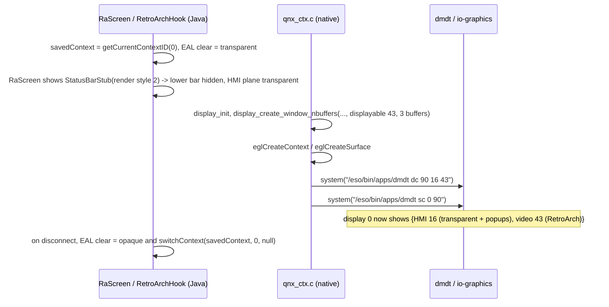

# Display context 90 = {HMI 16, video 43}

The HMI never gives up Screen. RetroArch draws into a compositor **displayable** and the display
manager (io-graphics, controlled by `/eso/bin/apps/dmdt` and Java `IDisplayManager`) decides which
displayables are on screen through a **context** = ordered set of displayables.

## Choices

| Decision | Value | Why |
|---|---|---|
| displayable | **43** `DIGITAL_VIDEOPLAYER_1` | a digital GLES video surface; no Java widget/controller, no node in any of the 63 `.kzb` Kanzi scenes (unlike `DVD_VIDEO` which has player UI). 44 is the spare. Avoid 19 (nav map) and gpSP's ad-hoc 200. |
| context | **90** | outside the stock Java table (0..78) and CarPlay's 80/81 |
| layer set | `{16, 43}` - HMI above video | same ordering as stock context 25 `{HMI 16, DIGITAL_VIDEOPLAYER_1 43}`; everything except HMI/HMI2 composites *under* the HMI (`isBackGroundLayer`) so the game shows through the transparent HMI plane |
| main-context id at launch | the RA state is entered from the MainWizard; Java just remembers `getCurrentContextID(0)` and restores it |

Before Sep 2026 the context was `{43}` only (no HMI plane at all). It was changed so that stock
**global partial popups - notably volume -** still render above the game.

## Who does what

Routing is done natively **only after** the EGL surface exists, so a failed video init never leaves
the display on an empty context. Java cannot switch to 90 (`IDisplayManager.switchContext(90)` would
index past the OEM `dc[]` table) but *can* switch back to the saved stock context.

## Why not patch `DisplayManagerMIB2High`

Both this jar and CarPlay's `carplay_hook.jar` are deployed to `/mnt/app/eso/hmi/lsd/jars/` and share
one classpath. Two jars carrying the same stock class = classloader order nobody controls, silent
loss of whichever patch loses. CarPlay already patches `DisplayManagerMIB2High` for contexts 80/81,
so it owns that class. Options ranked:

1. **Native `dmdt` (current).** Zero Java coupling; context 90 exists only while RetroArch runs.
2. **Runtime table extension** (documented, not implemented): find the live `DisplayManagerMIB2High`
   like `RuntimeSmmInjector` finds `SystemSMM`, read the inherited `dc` field from the `DisplayManager`
   superclass, validate length (79 stock, 82 with CarPlay on A5), grow to 91, `arraycopy`, set
   `dc[90] = new DisplayContext(90, new int[]{16, 43})`, swap, read back. Constraints: on a G24
   cluster the table is 158 entries and index 90 is a stock KDK context (`11 + 79`) - never write
   there; CarPlay may reallocate the array, so extend after it and re-check.
3. Put the declaration back into the CarPlay repo (`CTX_RETROARCH_MAIN = 90`, `DC_SIZE_A5 = 91`)
   and document the cross-repo dependency - rejected unless (1) and (2) fail.

## Reference: how the stock map does it

`libeal.so` (Kanzi-based scene graph) -> `libGLESv2.so.1` -> `display_create_window` (libdisplayinit)
-> Screen window -> EGL. Same bottom two links as RetroArch; the map's opacity fades are eal shader
uniforms, while for us the compositor blends at displayable level. `eal::api::ITextureShared::
updateFromDisplayable(id)` proves a displayable-capture path exists if it is ever needed.

Main-context ids for `sc`/`switchContext` (from `MainContext`): NONE 0, NAVIGATION 16, NAVIGATION_MAP
20, AUDIO 32, AUDIO_TUNER 36, AUDIO_MEDIA 39, PHONE 48, APPS 96, CONNECT 112, CAR 128.

## Verification status

`{43}`-only routing, restore on BACK/forced transitions: verified on HU (Aug 2026). `{16,43}` +
transparent HMI + status-bar stub + volume popup visibility: built 2026-09-01, **awaiting the unit**
([[hardware-validation-matrix]]).
