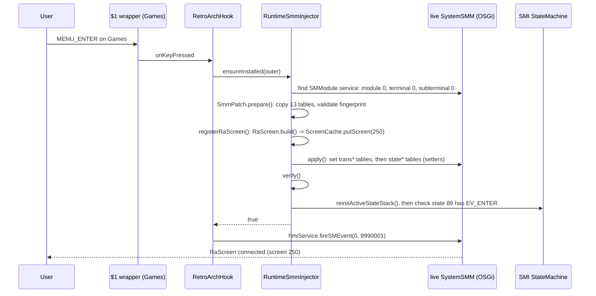

# Games menu + runtime SystemSMM injection

Goal: a **Games** row in the MainWizard that enters a real SystemSMM state whose screen owns the
RetroArch lifecycle - without shadowing any boot-critical OEM class.

## The single OEM shadow

`de.esolutions.hmi.widgets.audi.evo.widgets.AbstractPlaceholderMenuController$1` - the stock
anonymous `PlaceholderMenuItem` wrapper that every placeholder menu item is constructed through.
Our copy is ABI-identical and forwards everything to the wrapped `MenuItemController`; it only adds
two calls, both gated on `outer instanceof MainWizardController`:

- constructor -> `HookManager.onWrapperConstructed(outer, menuItem)`;
- `keyPressed` -> `HookManager.onKeyPressed(outer, menuItem, e)` (returns true = consumed);
- `getLabel` path -> `HookManager.getLabelOverride` (returns "Games" for widget id 10).

`HookManager` holds one hook: `RetroArchHook`.

## Adding the row

When the wrapper for the **Settings** item (`MainWizardWidgetIds.SETTINGS`) is constructed,
`RetroArchHook.onWrapperConstructed` appends a new `MenuItemController` copying Settings' colour
indices/insets, `widgetID = 10` (`CustomWidgetIds.GAMES`), `event = EV_ENTER (9990001)`, internal id
from `IdAllocator.nextFreeInternalId(outer, 2000)`. Duplicate protection: `hasGamesItemAlready`.

## Entering: fail-closed runtime injection



Result: `MainWizard state 89 --EV_ENTER 9990001--> RetroArch state 631 (screen 250) --EV_EXIT 9990002--> state 89`.

### Fingerprint that must match (MU1316) - otherwise nothing is touched

| Check | Expected |
|---|---|
| state tables (`stateFlagList`, `stateSuperstateList`, `stateDHSList`, `stateHistoryList`, `stateTriggerEventList`, `stateOutTransList`, `stateMediatorList`, `stateSync*List`) | length **631** |
| transition tables (`transFlagList`, `transTrgtFlagList`, `transTrgtStateList`) | length **890** |
| state 89 | flags 0, superstate 94, DHS (screen) 46, triggers `{-13, 1539}`, out-transitions `{357, 757}` |
| collisions | no state uses screen 250, event 9990001 or 9990002 |

New ids: state `631`, transitions `890` (enter) and `891` (exit). New state: flags 0, same
superstate as 89 (94), DHS = 250, history -1, trigger `{EV_EXIT}`. `apply()` publishes transition
tables first (unreachable until the state trigger table points at them), then the per-state tables,
then the longer flag table. Any throw -> `rollback()` restores every old reference and the SMI stack
is refreshed again; `ensureInstalled` returns false and `EV_ENTER` is never fired.

### Why the live SMI stack is refreshed

SMI's active `State` objects captured the trigger arrays at HMI boot. Swapping the `SystemSMM`
tables alone leaves the *active* state 89 object unaware of `EV_ENTER`, so the first Games click was
silently ignored until an unrelated transition recreated state 89. `reinitActiveStateStack()` on the
event thread fixes that before `installed = true`; the injector then asserts state 89 is active and
carries the new transition.

## RaScreen (screen 250)

`ScreenWidgetEVO` subclass, built once and preloaded into the OEM `ScreenCache` (the stock
`SystemScreenFactory` has no case 250 and is never replaced):

- `setCacheBehaviour(0)` always cached; `setClearMethod(0)` transparent HMI plane;
- `ScreenRendererHigh` with the factory's fonts (optional, nothing is drawn);
- a `StatusBarStubController` (model 138, render style **2**) - suppresses the lower status bar
  while keeping DISPLAYABLE_HMI available for global partial popups ([[display-context-90]]);
- `connected()` -> `RetroArchHook.onRaScreenConnected`; `disconnecting()` ->
  `onRaScreenDisconnecting` ([[session-lifecycle]]);
- `keyPressed`: `KEY_BACK (15)`, `KEY_MENU (30)`, `KEY_RC_BACK (41)` -> `requestRaExit()`
  (fires `EV_EXIT`); **every** key is consumed - the game only sees the USB pad.

## Log milestones (`ra_hook.log`)

```
injected Games MainWizard item (widgetID=10, event=9990001)
[SMM] found live SystemSMM: terminal=0 subterminal=0 name=...
[SMM] prepared OEM table copies: states 631->632, transitions 890->892
[SMM] preloaded RaScreen ID 250 into OEM ScreenCache
[SMM] refreshed live SMI stack: [...,89,...]
[SMM] runtime SMM install PASS: state=631 enterTrans=890 exitTrans=891 screen=250
fired main SystemSMM EV_ENTER=9990001
RA state connected: ...
```

Forbidden shadows are enforced at build time: [[java-jar-build]].
