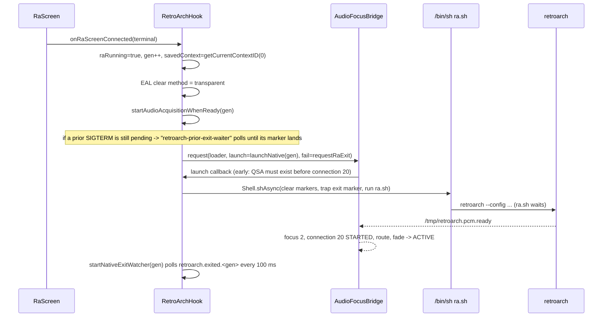

# Session lifecycle - RaScreen connect to native exit

`RetroArchHook` is a static state machine keyed by a **session generation**. Every watcher thread
carries the generation it was started for and exits silently when it no longer matches, so a fast
BACK -> Games -> BACK sequence never lets an old watcher act on a new session.

## State

| Field | Meaning |
|---|---|
| `raRunning` | RaScreen is the connected main screen |
| `nativeStarted` | `ra.sh` was exec'd for this generation |
| `audioAcquisitionStarted` | `AudioFocusBridge.request` was issued |
| `savedContext` | `IDisplayManager.getCurrentContextID(0)` at connect, restored at disconnect |
| `sessionGeneration` | incremented on connect and on disconnect |
| `pendingShutdownGeneration` | a SIGTERMed native process whose exit marker is awaited |
| `stuckShutdownGeneration` | that process missed the 5 s exit timeout; relaunch refused until it is gone |

## Markers in `/tmp`

| File | Writer | Reader | Meaning |
|---|---|---|---|
| `retroarch.lock` | native (`platform_qnx.c`) | Java `Shell.signalRetroArch`, `ra.sh` | PID to signal; cleared by `ra.sh` after `wait` |
| `retroarch.pcm.ready` | native QSA driver | `AudioFocusBridge` | PCM opened + prefilled |
| `retroarch.exited.<gen>` | `ra.sh` wrapper (`trap ... 0` and after `wait`) | exit watcher, release watcher | native process ended (any reason) |
| `retroarch.audio.desired` | Java `Shell` | native `qnx_ctx.c` | latest desired audio state (`0`/`1`) for SIGRTMIN(+1) |

## Connect



The audio sequence itself: [[audio-session]]. Display routing happens **natively** after EGL init
([[video-context]]); Java only saves/restores the previous context because the OEM Java table has
no context 90 ([[display-context-90]]).

## Disconnect (BACK, MENU, or any OEM-forced transition: PDC, camera, call, shutdown)

`RaScreen.disconnecting()` -> `onRaScreenDisconnecting`:

1. `beginRelease()` on the audio bridge (stops callbacks/recovery, keeps connection 20 alive);
2. `raRunning=false`, `sessionGeneration++` (retires the exit watcher);
3. EAL clear method = opaque; `IDisplayManager.switchContext(savedContext, 0, null)`;
4. if native ran: `pendingShutdownGeneration = gen`, `Shell.terminateRetroArch()` (SIGTERM to the
   lock PID), start `retroarch-audio-release-watcher`: wait <= 5 s for `retroarch.exited.<gen>` (or a
   dead PID), then `AudioFocusBridge.finishRelease(token)` - the OEM connection/focus/route are
   restored **after** QSA closed, never while a second PCM writer could exist. A timeout sets
   `stuckShutdownGeneration`.
5. if only audio was acquired (launch never happened): release immediately.

BACK from the HMI hard keys never reaches the emulator; RaScreen fires `EV_EXIT` and the SMM
disconnects the screen, so every exit path is the same path.

## Native exits on its own (menu Quit, crash)

No HMI key event exists for that, so the exit watcher sees the marker, releases audio, and fires
`EV_EXIT` itself (`nativeProcessExited`). The transparent RA screen is therefore never left behind.

## Re-entry protection

- **Duplicate Enter** while `raRunning`: ignored.
- **Prior shutdown pending**: audio acquisition waits for the old marker (`retroarch-prior-exit-waiter`).
- **Prior shutdown stuck** (`stuckShutdownGeneration >= 0`): if its marker now exists or the recorded
  PID has no live threads (`pidin -p<pid> threads`; a threadless `/proc/<pid>` is a QNX zombie), the
  latch is cleared; otherwise the launch is refused, SIGTERM is re-sent and the state exits.
  Fail-closed: a `pidin` failure counts as alive, never risking two QSA writers.

## Force kill

There is no automatic SIGKILL escalation in the Java hook today; the README's HOLD-BACK design is
not implemented. A wedged process is handled by the "stuck" latch above (Games refuses to relaunch
and logs `refusing relaunch: prior native process missed exit timeout`) and by `slay -f -Q
retroarch` over ssh. `ra.sh` also KILLs a stale io-hid before every launch ([[launcher-ra-sh]]).

## Log lines to expect

```
RA state connected: acquiring OEM audio, saved context 25, native route=90{16,43}, clear=transparent
OEM route ready: launched native RetroArch
RA state disconnected: restored context 25, sent SIGTERM; audio release waits for QSA close
native RetroArch exited: requesting SystemSMM EV_EXIT=9990002        (menu Quit / crash path)
audio session released after native PCM close                        (ra_audio.log)
```
