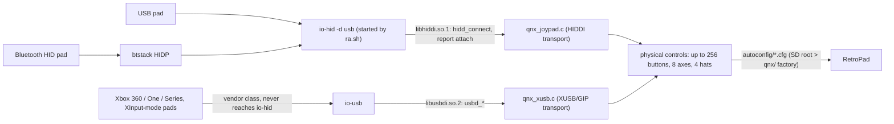

# Input - io-hid HIDDI pads and io-usb XUSB/GIP Xbox pads

Hard keys (MENU/BACK/rotary) belong to the HMI and never reach the emulator ([[games-menu-injection]]).
The game sees only gamepads. `input_driver = qnx_input` is a null stub; all input is the joypad
driver `qnx` with two transports.

## HIDDI transport (`qnx_joypad.c`)

- Walks application collections recursively, scans all 32 (possibly sparse) input-report indices,
  attaches every unique report and keeps per-report state before aggregation. The real HU pad's only
  usable input is **report index 1**. Hot-plug; up to `MAX_USERS` pads.
- Normal path: public `hidd_get_all_buttons / hidd_get_buttons / hidd_get_usage_value`.
- **Fallback descriptor parser**: QNX 6.5's preparser returns zero values for the HU's valid
  9-byte gamepad report, so the driver reads the raw HID report descriptor (`hidd_get_report_desc`,
  exported by `libhiddi.so.1` but missing from the public header; used only after an exact HIDDI
  v1.00 server check) and parses Main/Global/Local items itself: Button-page variable/array fields,
  X/Y/Z/Rx/Ry/Rz/Slider/Dial, native hat switches, report ids and logical ranges.
- A narrow SDL-derived decoder handles the verified 8BitDo 9-byte and enhanced reports (including
  the feature report that enables enhanced mode).
- **Rumble** via HID output reports described by `rumble/qnx/<vid>_<pid>_<report-id>.cfg`; report id,
  descriptor length and every offset are validated before attaching - unknown layouts are never
  guessed. Shipped: DS3, DS4 v1/v2, DualSense/Edge, SDL-listed 8BitDo, Xbox One/Elite/Series BT ids
  (Sony BT profiles carry sequence tags + CRC32).
- Bluetooth pads arrive through the same callbacks (io-hid aggregates transports; `btstack` speaks
  HIDP). Open: whether the stock pairing UI pairs a non-phone HID device.

## XUSB/GIP transport (`qnx_xusb.c`, `libusbdi.so.2`)

Compact port of SDL's hidapi Xbox drivers: wired Xbox 360/XUSB (incl. 8BitDo/GameSir XInput modes),
the 4-port 360 wireless receiver, Xbox One/Series GIP (announce/identify/ACK/startup, chunked
packets), hot-plug, two-motor rumble. Matches exact class/subclass/protocol plus SDL's vendor
allowlists, opens only the selected interrupt/bulk endpoints, detaches unknown vendor interfaces
immediately. A built-in name-matched XInput profile gives third-party VID/PIDs the standard layout.

## Mapping = data, not code

234 libretro DInput/HID profiles retargeted to `input_driver = "qnx"` live in
`/mnt/app/root/retroarch/autoconfig/qnx/` and are seeded into `/fs/sda0/retroarch/autoconfig/qnx/`
(factory version 3, [[launcher-ra-sh]]). User "Save Controller Profile" writes to the autoconfig
root, which wins. Unknown products use `QNX HID Gamepad.cfg`. Remaps go to `config/remaps/`.

Menu OK/Cancel orientation is inferred from the Player-1 profile's physical labels (A/B vs
Cross/Circle) or set explicitly with `input_menu_ok_cancel_layout = "western"|"nintendo"`;
`menu_swap_ok_cancel_buttons_auto = "true"` drives Ozone footer icons/hit zones only.

## Debugging on the unit

- `RA_QNX_HID_DEBUG=1` (topology) and `RA_QNX_HID_DUMP=1` (first eight packets per report) - both
  exported by `ra.sh`; output lands in the timestamped `retroarch__*.log`.
- `/usr/sbin/hidview` ships in the firmware and uses the same API - dump a pad's collections and
  report data before fighting the driver.
- One `io-hid -d usb` per session; a wedged persistent instance made even `test -e /dev/io-hid`
  block forever - never stat it ([[launcher-ra-sh]]).

`libhiddi.so.1` is bundled (`pkg/runtime-libs`, SDP copy); `libusbdi.so.2` is present in the
firmware (`ifs_coreservices3/lib`) and not bundled. Every rumble family and the raw Xbox path still
need controller-by-controller validation ([[hardware-validation-matrix]]).
