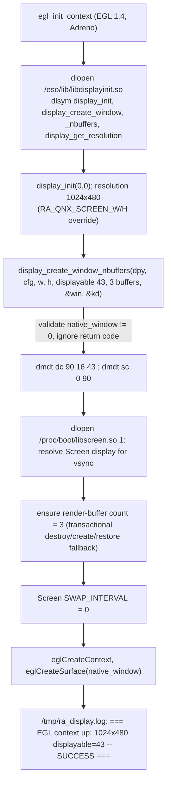

# Video context - libdisplayinit, EGL, Screen vsync

`src/gfx/drivers_context/qnx_ctx.c` (1030 lines, upstream's BB10 file was 11 KB) is the GLES2
context driver behind `video_driver = "gl"`. Nothing from the SDP's Screen headers is used: every
Screen/libdisplayinit symbol is `dlopen`/`dlsym`ed from the firmware at runtime.

## Init sequence (`gfx_ctx_qnx_init`)

Facts baked into that order:

- **The vendor return value of `display_create_window*` is unreliable** (non-zero with a valid
  window). Only the output window is checked, like gpSP/PCSX do.
- **Route before creating the EGL surface.** Creating the surface while the OEM context is still
  active makes the Adreno stack throttle the first submission of every frame to the old compositor
  cadence (~30 Hz) even with interval 0. Routing details: [[display-context-90]].
- **Three buffers, requested at creation.** RE of `libdisplayinit.so` shows the 7-arg
  `display_create_window` hardcodes buffer count 2 and delegates to the 8-arg
  `display_create_window_nbuffers`, which passes the count to `screen_create_window_buffers`
  unclamped. Measured: lightweight swap 16.9 ms with 2 buffers -> 8.5 ms with 3. **Four buffers
  break the unit**: Screen creates them, `eglCreateWindowSurface` fails `EGL_BAD_ALLOC (0x3003)` and
  the HU temporarily stopped answering ssh. `RA_QNX_SCREEN_BUFFERS` accepts 2..4 but only 2/3 are
  supported.
- `GRAPHICS_ROOT=/proc/boot/` must be set by the launcher or `egl14.so` crashes in `OpenSubDriver`
  ([[launcher-ra-sh]]).

## Presentation and vsync

- EGL swap interval is **always 0** and the native Screen `SWAP_INTERVAL` property is set to 0 as
  well: interval 1 blocks forever on this display-manager layer after the first post, and Adreno's
  `eglSwapInterval(0)` does not reliably propagate to a libdisplayinit window (every swap then blocks a
  full period -> a 60 Hz core runs at ~54 FPS).
- When RetroArch asks for vsync (`video_vsync = true`), `swap_buffers` first does a **bounded**
  `screen_wait_vsync(display)`: a QNX `TimerTimeout(SEND|REPLY, 25 ms)` is armed around the single
  `MsgSend` so a missing display-manager acknowledgement costs at most one frame instead of a
  frozen render thread. On the first failure the driver falls back permanently to a **software
  deadline** at exactly 16.666667 ms (`QNX_SOFTWARE_REFRESH_NS`), so a `video_vsync=true` config can
  never become an unlimited runloop.
- Measured effect of turning vsync on (PPSSPP era): `post` idle spin 22.6 ms -> 0.025 ms per frame;
  frontend frame 24 ms -> 9.8 ms of which 9.4 ms is the wait. Whether vsync or blocking audio should
  own pacing is still open: [[frame-and-audio-pacing]].
- While `qnx_lifecycle_paused` is set, `swap_buffers` returns without posting (0 GPU; the compositor
  keeps the last buffer).

## Per-frame reconcile (`gfx_ctx_qnx_check_window`)

Runs on the main thread every frame: `*quit = frontend_driver_get_signal_handler_state()`, pause
desired-state reconcile, audio-focus edge handling ([[signals-and-lock]]), then size query.

## Tracer

`ra_dbg()` appends to `/tmp/ra_display.log` with raw `open/write` (RetroArch's `FILE*` logging is
not wired at that point of boot). It logs EGL config, window/buffer/interval read-backs, the vsync
probe (`Screen vsync probe: display=%p capable=%d`) and the first four swaps. It is unbounded -
delete it occasionally; it lives in tmpfs and vanishes at reboot.

## Firmware fingerprints used (MU1316)

`libdisplayinit.so` `5be545ea...` (`display_create_window` @0x11bc -> `_nbuffers` @0x0e00),
`libEGL.so.1` `a7b3ad6b...`, `egl14.so` `2f44c706...` (`qeglDrvAPI_eglSwapBuffers` @0xc6d8),
`eglsub-screen.so` `204df495...` (posts via `screen_post_window`, waits on condvars when no render
buffer is free = the 15-17 ms two-buffer stall), `libscreen.so.1` `4fed3e9a...`. Full note:
[[egl-swap-path]].
