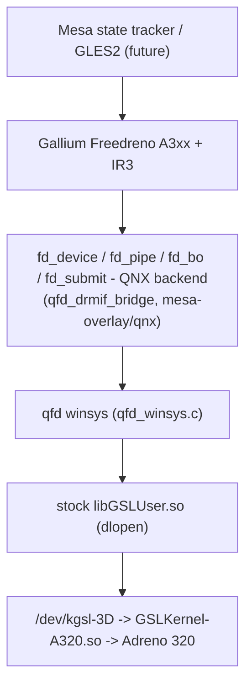

# Freedreno A3xx on QNX - a Mesa backend over the stock GSL transport

**Status: offline/QEMU-validated only. Nothing is deployed to the HU or the package; it is not an
EGL/GLES2 replacement yet.** Motivation: the stock driver's 16 ms/frame CPU overhead
([[adreno-driver-hotpath]]); Mesa's Gallium Freedreno + IR3 is the only open A3xx stack.

## Architecture



- `qfd_winsys`: dynamic loading of the MU1316 `libGSLUser.so` exports; device info; 3D context
  lifecycle; BO alloc / CPU map / 32-bit GPU VA / cache ops; bounded IB submission with BO
  ownership/range/alignment checks; rollover-safe timestamp read/wait; injectable dispatch for host
  tests. ABI from [[gsl-port-boundary]].
- `qfd_drmif_bridge` + `mesa-overlay/qnx/`: Mesa's device/pipe/BO/ringbuffer/reloc/submit/fence model
  on that transport. QNX Mesa build = only the A3xx Gallium backend + IR3; shader disk cache off
  (QNX 6.5 lacks ELF build-id enumeration); the QNX patch also initialises/destroys the
  `u_trace_flush` queue fence explicitly (Mesa's first async trace job otherwise asserts on QNX).
- Raw GSL context/allocation/submit flags are explicit; zero flags work in the QEMU resmgr but that
  is not evidence for the physical unit.

## Reproduce

```sh
tools/qnx-freedreno/test-host.sh          # host unit tests of winsys/bridge with injected dispatch
tools/qnx-freedreno/build-qnx.sh          # transport probes for QNX ARM
tools/qnx-freedreno/build-mesa-qnx.sh     # Meson cross build (mesa-qnx-armv7.ini, mesa-qnx.patch, pinned commit)
tools/qnx-freedreno/run-qemu.sh           # disposable QNX6 image at 0xd1000000 (Mesa probe is too big for the boot IFS)
```

Mesa checkouts (`build/mesa-freedreno-*-src/`, ~1.4 GB) and static builds
(`build/qnx-freedreno/mesa-static*/`) are gitignored; `SHA256SUMS` + `MESA_COMMIT` record them.
Outputs: `libfreedreno_qnx_drm.a`, `libfreedreno_qnx_winsys.a`, `libfreedreno_ir3.a`,
`libfreedreno_a3xx_gallium.a`, `qnx-freedreno-screen-probe` (+ `.symbols`).

## Verified in QEMU (`build/qnx-freedreno/qemu-runs/run-*/`)

GSL device info = Adreno 320, 512 KiB GMEM; alloc/map/cache/free + context/timestamp lifecycle;
NOP submit; `CP_MEM_WRITE` readback; synthetic IR3 triangle with `CP_DRAW_INDX_2`; the DRMIF-shaped
BO/reloc/submit/fence path with canary readback; **Mesa `fd_screen_create()` reports `FD320`, creates
a real Gallium context, compiles a clear through the normal async path, submits the A3xx command
stream and sees the fence retire.**

Modes: `--qemu-only` (submit+fence must pass; pixel readback `SKIP` because the QEMU translator keeps
render targets in a host FBO), `--hardware` (mapping failure or any pixel other than ~`{64,128,191,255}`
fails). The retained host-FBO trace (`diagnostics/mesa-clear-host-fbo-20260909/`) shows the 16x16
target going black->white, not the requested colour - an incomplete QEMU PM4->GL translation, not
counted as a render pass.

## Not proven

Adreno performance, physical cache coherency, Screen presentation latency, that Mesa's colour
reached a physical target; no Screen buffer import/present; no EGL/GLES2 frontend.

## Remaining HU gates (in order; no perf or packaging claim before 1-6)

1. Non-submitting info probe (`tools/qnx-gsl-port/run-probe.sh`).
2. Allocation flags, mappings, cache clean/invalidate with no IB.
3. Context creation (handle `0` is valid).
4. `qnx-freedreno-screen-probe --hardware`: Mesa offscreen clear, bounded fence wait, strict readback.
5. Mesa offscreen triangle + readback.
6. Screen buffer import/present + synchronisation.
7. EGL/GLES2, then profile the RetroArch/PPSSPP matrix against the stock driver.
