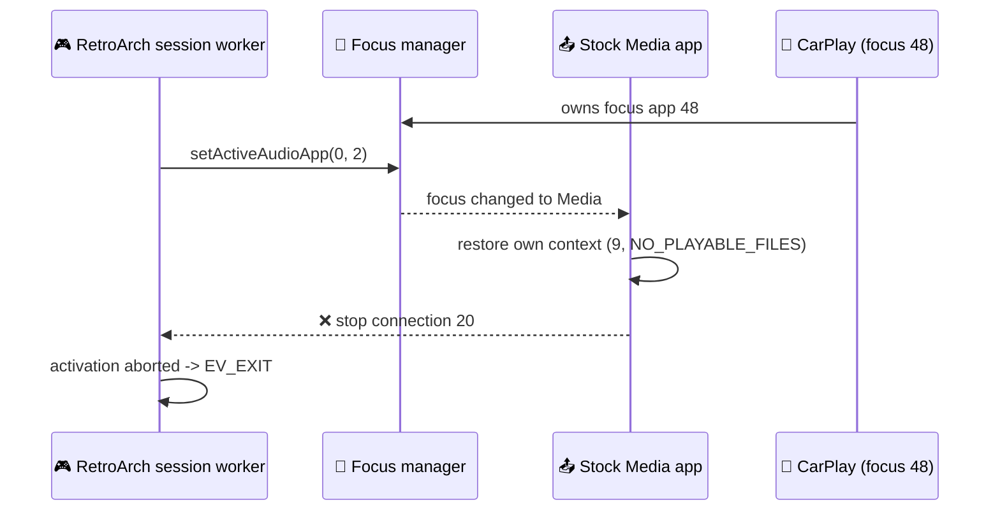

# Known issues

_What is broken or unfinished today, why, and what to do about it._

---

Each entry states the observed behaviour first, then the mechanism, then the workaround. For the
wider "proven vs pending" split see [[hardware-validation-matrix]].

## ⚠️ CarPlay connected: the game exits immediately

**Observed.** With an iPhone connected over CarPlay, selecting *Games* brings up the RetroArch
screen for a moment and then drops back to the car menu.

**Mechanism.** CarPlay owns front-terminal audio focus (**app 48**) and the stock Media
application's own audio context. The session worker asks for focus app 2 and entertainment
connection 20; the CarPlay/Media side reclaims focus or restores its suppression context
(**connection 9**, `NO_PLAYABLE_FILES`), connection 20 is stopped, and the acquisition path
gives up. Historically that path ended in `requestRaExit()`, which is exactly the observed exit.

**Work done so far.** Commit `568a4b5d` fixed the first half: the very first focus-48 callback no
longer counts as an interruption (`lossArmed`). Commit `8c54b47e` added `MediaSessionBridge`,
which registers an `IMediaTerminalExtension`, sets connection 20 as *Media's own* active context
before the focus change, and replaces the abort with `waitMutedForRecovery` — the RA screen stays
up, muted, until focus comes back. **Neither has been confirmed on the unit yet**, and the
symptom is still reported.

**Workaround.** Disconnect the phone (or leave CarPlay) before starting a game.

**Next diagnostic step.** Reproduce with `/fs/sda0/retroarch/logs/ra_audio.log` open and capture
the lines around `captured focus=48`, `start conn=20`, `stop conn=20`. Details of the sequence:
[[audio-session]].

---

## ⚠️ Bluetooth gamepads do not work

**Observed.** Only USB pads are usable. A Bluetooth pad paired through the stock phone UI does not
appear to RetroArch.

**Mechanism.** In theory io-hid aggregates HID regardless of transport and the firmware's
`btstack` speaks HIDP, so a BT pad should arrive through the same HIDDI callbacks as a USB one —
that was the original assumption. In practice two things block it: the stock pairing UI is built
for phones and does not offer a generic HID device, and `ra.sh` starts its **own** `io-hid -d usb`
instance for the session (`upath=/dev/io-usb/io-usb`), which only attaches USB devices. Driving
`btstack` directly and adding a second io-hid transport has not been attempted.

**Workaround.** Use a USB pad, or a wireless pad with its own USB dongle (8BitDo 2.4 GHz and
Xbox wireless receiver both work — the latter through the XUSB path). Details: [[input-hid-xusb]].

---

## ⚡ Performance: N64 and heavy PS1 titles drop frames

**Observed.** GBA and most PS1 titles run at full speed. N64 and the heaviest PS1 scenes stutter,
and audio can develop seams during loading.

**Mechanism.** The ceiling is the head unit's GPU driver, not the emulators. A measured
PSP/N64-shaped command stream costs 22.99 ms per frame on this Adreno 320, of which **15.7 ms is
CPU-side validation and command generation inside `OpenGLES20.so`** and only 4.5 ms is actual GPU
work ([[gles2-benchmark]], [[adreno-driver-hotpath]]). Two QNX-specific costs on top of it have
already been removed: an unconditional condvar signal per GL call that burned 59 % of on-CPU time,
and a vertex over-read that crashed the threaded renderer ([[qnx-sync-cost]]).

**What helps today.** Keep `mupen64plus-43screensize = 640x480`; leave frameskip off (it removes
the rate limiter and pitches audio up rather than fixing anything, see
[[frame-and-audio-pacing]]); prefer lighter titles.

**What would actually fix it.** Sending fewer GL calls (batching, uniform/state caching) or a
different GL stack entirely — the Mesa/Freedreno research in [[freedreno-qnx]].

---

## 💾 Automatic save states are disabled

`RA_QNX_AUTO_SAVE_STATE=0` in `ra.sh`. A lifecycle pause always flushes SRAM, but no save state is
written, because state save/load has not been re-validated on hardware since the C++ runtime
repair (a PPSSPP build previously crashed in `ldqnx.so.2::__gnu_Unwind_Find_exidx` on exactly that
path, see [[ppsspp-status]]). In-game saves are safe. Enable it per card only after one manual
Save + Load passes on every core: [[signals-and-lock]].

---

## 🔒 One firmware only

The runtime injector validates an exact fingerprint of the stock state machine — 631 states, 890
transitions, and the trigger/transition arrays of MainWizard state 89 — before touching anything.
On any other firmware it fails closed, logs `runtime SMM install FAILED`, fires no event and
changes nothing. The *Games* row still appears but does nothing.

A G24 cluster unit is worse than unsupported: display context 90 is a stock KDK context there, so
the native `dmdt` call would overwrite it. Do not run this on G24 without changing the context id
([[display-context-90]]).

---

## 📌 Smaller rough edges

| Issue | Detail |
| ----- | ------ |
| **Connection 20 sticks** (dormant) | Once, three launches in a row were refused in 17-43 ms (`pause conn=20`); a reboot cleared it and it never recurred. If it returns, capture `ra_audio.log` + `ra_hook.log` at that moment ([[audio-session]]) |
| **`flock` does nothing** | Neither FAT32 nor tmpfs supports it on this unit, so `/tmp/retroarch.lock` is only a PID file; relaunch serialization is done in Java instead ([[signals-and-lock]]) |
| **No force-kill path** | The HOLD-BACK → `SIGKILL` escalation described in the original design was never implemented. A wedged process latches *Games* off until it dies or you `slay -f -Q retroarch` ([[session-lifecycle]]) |
| **Four Screen buffers hang the unit** | `eglCreateWindowSurface` returns `EGL_BAD_ALLOC` and the unit temporarily stops answering ssh. Only 2 or 3 are supported ([[egl-swap-path]]) |
| **`tracelogger` reboots the unit** | The instrumented kernel works but the load spike trips the watchdog; use the sampling profiler instead ([[profiler]]) |
| **`/tmp/ra_display.log` is unbounded** | The display tracer appends forever; it lives in tmpfs and clears on reboot ([[video-context]]) |
